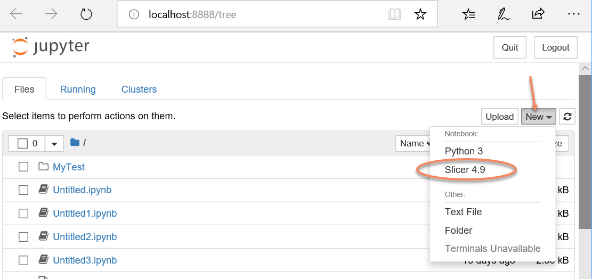

# SlicerJupyter
Extension for 3D Slicer that allows the application to be used from Jupyter notebook

*This project is under active development. Its content, API and behavior may change at any time. We mean it.*

# Usage

## Setup

* Install Python and Jupyter notebook
* Install 3D Slicer and SlicerJupyter extension, restart Slicer
* Switch to JupyterKernel module, select _Python Scripts folder_. This is the folder where _jupyter-kernelspec_ executable is located. On Windows by default it is a location such as _c:\Users\(username)\AppData\Local\Programs\Python\Python37-32\Scripts_.
* Click _Install Slicer kernel in Jupyter_.

## Using Slicer from a notebook

* Start Jupyter notebook
* Select _Slicer 4.9_ kernel. Jupyter will open a new Slicer instance automatically when kernel start is requested; and this instance will be closed when kernel shutdown is requested.



* While the kernel is starting, "Kernel starting, please wait.." message is displayed. After a few ten seconds Slicer kernel should start.
* Add `display()` at the end of a cell to display Slicer viewer content in the notebook.

## Example

Load a sample data and show an axial slice view:

<pre>
slicer.mrmlScene.Clear(False)
import SampleData
sampleDataLogic = SampleData.SampleDataLogic()
volume = sampleDataLogic.downloadCTChest()
slicer.app.layoutManager().setLayout(slicer.vtkMRMLLayoutNode.SlicerLayoutOneUpRedSliceView)
display()
</pre>

Create a surface mesh from the image:

<pre>
parameters = {}
parameters["InputVolume"] = volume.GetID()
parameters["Threshold"] = 220
outModel = slicer.vtkMRMLModelNode()
slicer.mrmlScene.AddNode( outModel )
parameters["OutputGeometry"] = outModel.GetID()
grayMaker = slicer.modules.grayscalemodelmaker
slicer.cli.runSync(grayMaker, None, parameters)
slicer.app.layoutManager().setLayout(slicer.vtkMRMLLayoutNode.SlicerLayoutOneUp3DView)
slicer.app.layoutManager().threeDWidget(0).threeDView().resetCamera()
display()
</pre>

# Known limitations

- Inspect (Shift-Tab) is not implemented yet

# For developers

* Build the extension against the newly built Slicer with Qt5 and VTK9 enabled.

* Install Jupyter

```
mkvirtualenv -p python3.5 jupyter_env  # Create and activare virtual environment

pip install jupyter
```

* Install kernel

```
jupyter-kernelspec install /tmp/SlicerJupyter-build/inner-build/share/Slicer-4.9/qt-loadable-modules/JupyterKernel/Slicer-4.9/ --replace --user
```

* Start notebook

```
workon jupyter_env
python -m jupyter notebook
```
