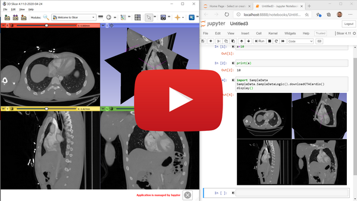
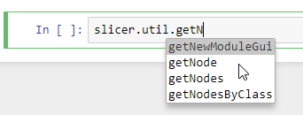

# SlicerJupyter
Extension for 3D Slicer that allows the application to be used from Jupyter notebook

Demo video: https://youtu.be/oZ3_cRXX2QM

[](https://www.youtube.com/watch?v=oZ3_cRXX2QM "Slicer Jupyter kernel demo")

# Usage

## Option 1. Run using Binder

You can use this option for a quick start. No installation or setup is needed, just click the link below and start using Slicer via Jupyter notebook in your web browser.

[](https://mybinder.org/v2/gh/Slicer/SlicerNotebooks/master)

When you click on the link, Binder launches 3D Slicer with SlicerJupyter extension on their cloud servers. Binder is a free service and server resources are quite limited. Also, there is no interactive access to the graphical user interface. Therefore, this option is only recommended for testing, demos, or simple computations or visualizations.

## Option 2. Run Slicer and Jupyter on your own computer

### Setup

* Install [3D Slicer](https://download.slicer.org/), start it, and install SlicerJupyter extension in its Extension Manager, restart 3D Slicer
* Install Python packages **in 3D Slicer's Python console** by copy-pasting these lines:
```
import os
if os.name=='nt':
    # There are no official pyzmq wheels for Python-3.6 for Windows, so we have to install manually
    pip_install("https://files.pythonhosted.org/packages/94/e1/13059383d21444caa16306b48c8bf7a62331ca361d553d2119696ea67119/pyzmq-19.0.0-cp36-cp36m-win_amd64.whl")
else:
    # PIL may be corrupted on linux, reinstall from pillow
    pip_install('--upgrade pillow --force-reinstall')
pip_install("ipywidgets pandas ipyevents ipycanvas")
```
* Install a Python distribution and Jupyter
  * Install [Anaconda](https://www.anaconda.com/products/individual) (recommended) or any other Python distribution (see installation instructions [here](http://jupyter.org/install))
  * You can choose any Python version and any bitness (Python 3, 64-bit is recommended)
  * Adding Python to your PATH environment variable or registering as default Python is not required
  * Start a command prompt in the Python environment
  * Install widget support by running these commands in the Python command prompt:
```
python -m pip install jupyter ipywidgets pandas ipycanvas ipyevents
jupyter nbextension enable --py widgetsnbextension
jupyter nbextension enable --py ipyevents
```
  * For Jupyter lab, run these additional commands:
```
conda install -c conda-forge nodejs
pip install ipywidgets ipyevents ipycanvas
jupyter labextension install @jupyter-widgets/jupyterlab-manager
jupyter labextension install @jupyter-widgets/jupyterlab-manager ipycanvas
jupyter labextension install @jupyter-widgets/jupyterlab-manager ipyevents
```
* Install Slicer kernel in the Python command prompt:
  * Switch to JupyterKernel module in 3D Slicer
  * Click "Copy command to clipboard" to copy the kernel installation command to the clipboard
  * Paste the command in the Python command prompt (not in Slicer's Python console)
* Start Jupyter notebook. For example, by runnning _jupyter-notebook_ executable.

See video of installation steps using Anaconda here:

[](https://youtu.be/jcRsRw6RC2g)

## Using Slicer from a notebook

* Create a new notebook, selecting _Slicer 4.x_ kernel (for example, _Slicer 4.11_). Jupyter will open a new Slicer instance automatically when kernel start is requested. This Slicer instance will be automatically closed when kernel shutdown is requested.


* While the kernel is starting, "Kernel starting, please wait.." message is displayed. After maximum few ten seconds Slicer kernel should start.
* Do a quick test - show views content in the notebook:

```
import JupyterNotebooksLib as slicernb
slicernb.ViewDisplay()
```

* Try the interactive view widget:

```
slicernb.ViewInteractiveWidget()
```

* Hit `Tab` key for auto-complete
* Hit `Shift`+`Tab` for showing documentation for a method (hit multiple times to show more details). Note: method name must be complete (you can use `Tab` key to complete the name) and the cursor must be inside the name or right after it (not in the parentheses). For example, type `slicer.util.getNode` and hit `Shift`+`Tab`.




## Examples

You can get started by looking at [example Slicer notebooks here](https://github.com/Slicer/SlicerNotebooks).

# For developers

## Build instructions

* Build the extension against the newly built Slicer with Qt5 and VTK9 enabled.

* Install Jupyter

```
mkvirtualenv -p python3.6 jupyter_env  # Create and activare virtual environment

pip install jupyter
```

* Install kernel

```
jupyter-kernelspec install /tmp/SlicerJupyter-build/inner-build/share/Slicer-4.11/qt-loadable-modules/JupyterKernel/Slicer-4.9/ --replace --user
```

* Start notebook

```
workon jupyter_env
python -m jupyter notebook
```

## Launch a kernel manually

Type this into Slicer's Python console to manually start a kernel that a notebook can connect to:

```python
connection_file=r'C:\Users\andra\AppData\Roaming\jupyter\runtime\kernel-3100f53f-3433-40f9-8978-c72ed8f88515.json'
print('Jupyter connection file: ['+connection_file+']')
slicer.modules.jupyterkernel.startKernel(connection_file)
```

Path of `connection_file` is printed on jupyter notebook's terminal window.

## Special commands

These commands must be the last commands in a cell.

- `__kernel_debug_enable()`: enable detailed logging of all incoming Jupyter requests
- `__kernel_debug_disable()`: enable detailed logging of all incoming Jupyter requests
